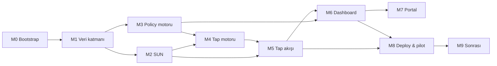

# Tappa — yol haritası

Kilometre taşları, sıraları ve **neden bu sırada** oldukları. Görev detayı için
milestone dosyalarına, nerede olduğumuz için [state.md](state.md)'ye bak.

## Kilometre taşları

| # | Ad | Amaç | Çıktı | Görev |
|---|---|---|---|---|
| **M0** | [Bootstrap](m0-bootstrap.md) | Zemini çalışır hale getir | `.env`, bağımlılıklar, ayakta Postgres, ilk commit, CI, yeşil `make check` | 7 |
| **M1** | [Veri katmanı](m1-veri-katmani.md) | Şema + tenant izolasyonu | 10 tablo, RLS, sqlc, seed, izolasyon testi | 11 |
| **M2** | [SUN doğrulama](m2-sun.md) | *Proof of moment* | `internal/sun`, atomik ctr, test vektörleri | 7 |
| **M3** | [Policy motoru](m3-policy-motoru.md) | Kuralları müşteriye aç, kırmızı çizgiyi kilitle | `internal/policy`, guardrail + baseline, açıklanabilir karar | 9 |
| **M4** | [Tap karar motoru](m4-tap-motoru.md) | Ürünün doğruluk çekirdeği | `internal/domain/tap`, §5'in her satırı testli | 7 |
| **M5** | [Tap akışı](m5-tap-akisi.md) | Çalışanın gördüğü ürün | aktivasyon → `GET /t` → `POST /api/checkin` → onay | 10 |
| **M6** | [Admin dashboard](m6-dashboard.md) | Müdürün gördüğü ürün | Transactions · Employees · Locations & Tags · Reports · **Policies** | 12 |
| **M7** | [Portal & signup](m7-portal.md) | Kendi kendine kayıt | landing, 3 adımlı sihirbaz, VAT, tenant provisioning | 5 |
| **M8** | [Deploy & pilot](m8-deploy-pilot.md) | Sahaya çıkış | VPS + managed PG, encode runbook, KF St Julians pilotu | 7 |
| **M9** | [Sonrası](m9-sonrasi.md) | Pilot sonrası | çevrimdışı kuyruk, push, CSV import, marka editörü | 7 |

Toplam **82 görev** (1'i ertelendi: M6-10 → M9-06).

## Bağımlılık zinciri

M2 ve M3 birbirinden bağımsızdır — M1 bittikten sonra paralel yürüyebilir.
M4 hem M3'ün hem M2'nin üstünde durur: kararlar artık kod içi `if` zinciri değil
policy motorundan gelen effect'lerdir (M3), ve M4-02 girdi tipleri `sun.Result`
şekline bağlıdır (M2-07).

## Neden policy motoru M3'te — tap motorundan önce

Tappa tek firmayla başlıyor ama **çok tenant'lı satılacak**. Her müşterinin
gerçeği farklı: birinin statik IP'si var, diğerinin yok; biri QR'a güveniyor,
diğeri güvenmiyor; birinin şubeleri arasında personel dolaşıyor, diğerinin tek
tesisi var.

Bu farkları koda `if tenant == …` diye yazmak ya da her karar için boolean ayar
sütunu açmak iki şekilde çöker: (1) her yeni müşteri kod değişikliği ister,
(2) ayarlar birbirine karışınca hangi kuralın neden kazandığı açıklanamaz hale
gelir — mesai kaydı hukuki delil olabilecekken bu kabul edilemez.

Motor **tap motorundan önce** gelir, çünkü `tap.Decide` onun üstünde yazılacak.
Sonradan takılan bir policy katmanı, önce yazılmış `if` zincirini yeniden yazmak
demektir.

## Neden dashboard 1. değil 6. sırada

[docs/handoff.md](../handoff.md) §10 yol haritası **1. madde olarak Admin
Dashboard** diyor. Bu bilinçli olarak değiştirildi; sıfır hafızalı bir ajan
handoff'u okuyup "dashboard önce" sonucuna varmasın diye gerekçe burada:

- Handoff'un yol haritası, dashboard'un **backend'siz statik HTML mockup** olduğu
  döneme aitti ([ADR 0001](../adr/0001-stack-secimi.md) ile stack Go + templ oldu).
  Artık dashboard gerçek tablolardan okuyor: şemadan önce yazılırsa iki kez yazılır.
- Ürünü öldürebilecek iki şey temelde: **ctr replay açığı** (§4.4) ve **tenant
  sızıntısı** (§4.5). İkisi de M1–M2'de çözülür.
- [CLAUDE.md](../../CLAUDE.md) §8, `internal/domain/tap` ve `internal/sun` için
  **%90+ kapsam** istiyor. Bu çekirdek, üstüne ekran koymadan önce kanıtlanmalı.
- Dashboard **gerçek KF/KM verisiyle** açılıyor (M1-10 seed) — mockup aşaması
  atlanmış oluyor. Üstelik artık policy ekranını da taşıyor (M6-09/10/11).

Handoff'un ürün içeriği (hangi sekmeler, ne gösterecek) aynen geçerli; değişen
yalnızca sıra.

## Riskler

| Risk | Etki | Azaltma |
|---|---|---|
| SDM CMAC hesabı ilk denemede tutmaz (kısaltılmış MAC tuzağı) | M2 uzar | Önce RFC 4493 vektörleriyle CMAC'i kanıtla, sonra SDM katmanını ekle (M2-02 → M2-04) |
| Gerçek NTAG 424 etiketleri gelmeden doğrulama sahte kalır | M2 "yeşil" görünüp sahada patlar | Test vektörleri + en az bir **fiziksel** etiketle uçtan uca doğrulama (M8-05) |
| Policy motoru fazla genel → kimse kullanamaz | M6-09 rafta kalır | Sık kullanılan kurallar **form** olarak sunulur, ham JSON ileri kullanıcıya; M6-10 simülatörü sonucu önceden gösterir |
| Müşteri politikayla kendini güvensiz hale getirir | Ürün itibarı | Guardrail katmanı gevşetilemez (M3-05), özellik testiyle kanıtlanır (M3-08) |
| **Buddy punching çözülmüyor** — telefonunu veren çalışan | Parmak izine göre gerileme; müşteri ilk demoda sorar | Kabul edilen risk + yazılı satış cevabı + tespit sinyali (M6-11 eş-zamanlı tap çiftleri) |
| **GPS sahtelenebilir** — mock location uygulaması | GPS-only tap kanıt değil beyan | Politikayla `flag`'e çekilebilir (M3-06), GPS-only oranı raporlanır (M6-11) |
| **URL biriktirme** — bir kez gel, sonra uzaktan bas | Uzaktan sahte mesai | Tazelik penceresi guardrail'i (M5-10) + POST'suz GET sinyali (M6-11) |
| iOS Safari uzun ömürlü çerezi kısaltırsa oturum ölür | Ürünün "tanınma" vaadi çöker | Q11 — M5-01 öncesi gerçek cihazda ölçülür |
| Statik IP'ler müşteride zamanında hazır olmaz veya çalışan WiFi'a bağlanmaz | *proof of place* zayıflar, `flag` oranı artar | GPS yolu zaten var; pilotta IP eşleşme **oranı ölçülür** (Q14) |
| GDPR silme talebi × immutable transactions | Hukuki | Q13 — saklama/anonimleştirme politikası pilot öncesi netleşir |
| Tek kişilik ekip, geniş kapsam | Takvim | M5 sonunda çalışan akışı uçtan uca biter; M6+ paralel satış demosu yapılabilir |

## MVP kapsamı dışında

Bunlar **bilinçli olarak yok**. Talep gelirse yol haritasına alınır, sessizce
eklenmez:

bordro hesabı · izin/tatil yönetimi · vardiya planlama (scheduling) · çalışan
self-service saat görünümü (→ M9-05) · mobil uygulama · çoklu dil (arayüz
İngilizce) · karanlık tema · SSO/SAML · muhasebe entegrasyonları (CSV/API ile
dışa aktarım var, entegrasyon yok) · politikaların tenant'lar arası paylaşımı
veya politika market yeri · **otomatik ödeme/abonelik tahsilatı** (Q24: iki
müşteri için fatura elle kesilir; sayım ve taslak M6-12'de otomatik).
